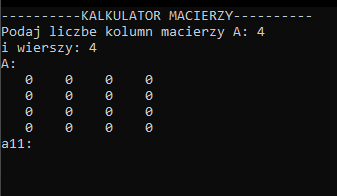
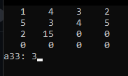
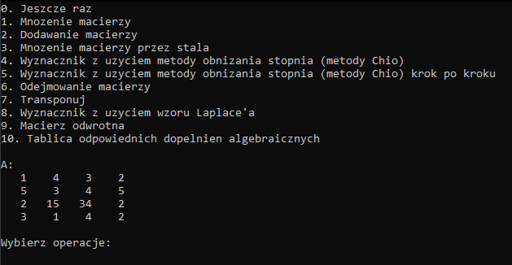

# Matrix Calculation

---

### Introduction
Written at the first semester of studies with really basic knowledge of C++ language. 
Done in the meantime as a joke, the one-file project is capable of some matrix calculations such as:
1. **Multiplication** of two matrices
2. **Addition**
3. **Multiplication** by a scalar
4. Determinant using **Chió** method
5. Determinant using **Chió** method (step by step)
6. **Subtraction** of two matrices
7. **Transposition** of a matrix
8. Determinant using **Laplace** method
9. **Inverse** of a matrix
10. Table of corresponding **cofactors** of the matrix

### Disclaimer
This is a simple project to learn some matrix calculations
in the meantime of studying for the exam. The purpose of it was to
ensure my calculations on paper were correct. At that time implementing
the equations in code seemed to be the best option.

### Screenshots

